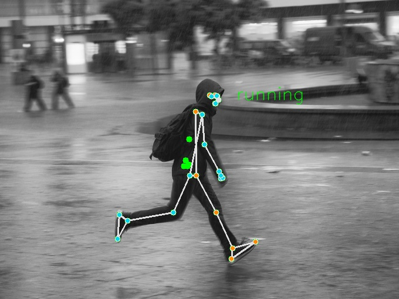
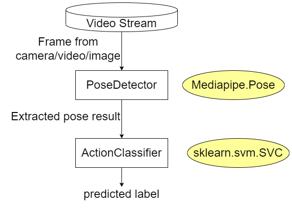

# Running motion detection



"Running in rain", by Sascha Kohlmann, CC BY-SA 2.0, retrieved from https://www.flickr.com/photos/skohlmann/24915873875/in/photostream/

---

## Background

Very often we will see someone running, trying to catch the bus, which always remind me the game Umamusume (ウマ娘) (賽馬娘)

It led to the idea of this project, what if we can detect if someone is running, and play the game theme song automatically? It would be funny. And here it is.

Sadly the current program only allow detection of 1 person using mediapipe's pose estimation method. I have tried other multi-person pose estimation models, but the output is not very accurate.

Mediapipe is updating their models right now (25 April 2023). Lets see what new things they are going to provide us.

---

## Sample Usage (also available in app.py)

```python
from running_detection.PoseDetector import SinglePersonPoseDetector, PoseDetectionResult
from running_detection.VideoStreamManager import VideoStreamManager
from running_detection.AudioPlayer import AudioPlayer
from running_detection.ActionClassifier import PoseActionClassifier
import time
from os import PathLike

def main(camera_id: int|str|None=None, 
         video_file: PathLike|str|None=None,
         fps: int=30,
         audio_path: PathLike|str|None=None,
         jogging: str="",
         display_image: bool=False,
         display_landmarks: bool=False):
  """play audio if detected people running in camera/video
  1 detect pose in frame (from camera/video)
  2 if pose is not detected (detected_pose is None) then
      - pause audio stream
    else 
      - detect action from pose information (walking, jogging, running)
      - if action is running then
          - resume (play) audio stream
        else
          - pause audio stream

  Args:
      camera_id (int | str | None, optional): _description_. Defaults to None.
      video_file (PathLike | str | None, optional): _description_. Defaults to None.
      fps (int, optional): _description_. Defaults to 30.
      display_image (bool, optional): _description_. Defaults to False.
      display_landmarks (bool, optional): _description_. Defaults to False.
  """
  audio_player = AudioPlayer(audio_path=audio_path)
  video_stream = VideoStreamManager(camera_id=camera_id,
                                    video_file=video_file,
                                    fps=fps)
  pose_detector = SinglePersonPoseDetector()
  action_classifier = PoseActionClassifier(jogging=jogging)
  
  last_resume_time = time.time()
  
  for frame in video_stream.read_frames():
    img=frame.copy()
    detected_pose: PoseDetectionResult|None = pose_detector.detect(img)
                                                                  #  display_image=display_image,
                                                                  #  display_landmarks=display_landmarks)
    if detected_pose is None: # continue to next frame if no pose detected
      audio_player.pause()
      action = ""
      # continue  
    else:
      action = action_classifier.classify(detected_pose)
      if action == "running":
        audio_player.resume()
        last_resume_time = time.time()
      else:
        current_time = time.time()
        if current_time - last_resume_time < 1: continue
        #  last_resume_time = current_time
        audio_player.pause()
        # audio_player.resume()

    action_classifier.display_image(img, action, detected_pose, display_image, display_landmarks)

if __name__ == "__main__":
  main(camera_id=0,
       # video_file="Dataset/KTH/running/person02_running_d1_uncomp.avi",
       # fps=60,
       display_image=True,
       display_landmarks=True)

```

---


## Program pipeline 

The pose action prediction model runs the following pipeline:


---

## Training

The dataset used to train the classifier is the KTH dataset (now only available on wayback machine https://web.archive.org/web/20190701125018/https://www.nada.kth.se/cvap/actions/).

It consists of 6 classes of actions in the form of .avi:

1. walking
2. jogging
3. running
4. boxing (not used)
5. handwaving (not used)
6. handclipping (not used)

### Preparing dataset: (see prepare_training_data.py for details)

I run the pose estimator on each frame of the video files, and extracted the pose data coordinates, stored as numpy array, and normalized them, finally they are stored in a csv file (see TrainingData/KTH_dataset.csv)

### Training the pose classifier: (see train_model.ipynb for details)

Afterwards, I trained 3 SVM (Support Vector Machine) classifiers in different settings:

1. treat 'jogging' data as if they were 'running' data **(Easy to classify 'walking' as 'running')**
2. treat 'jogging' data as if they were 'walking' data **(Easy to classify 'walking' as 'running')**
3. ignore 'jogging' data **(Resulted in better performance (model size and robustness), *default)**
